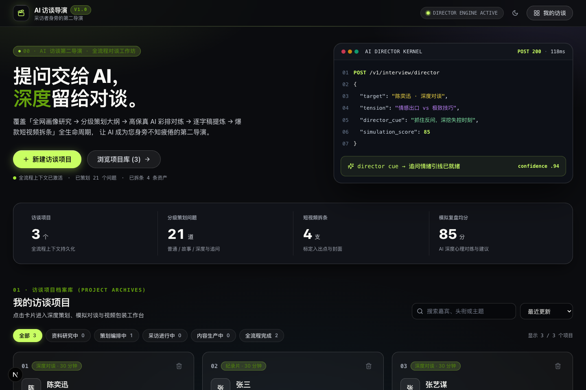
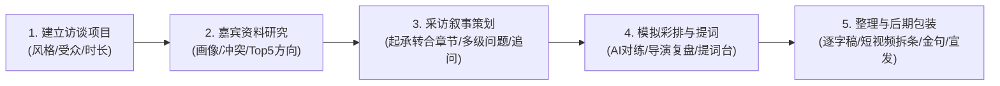
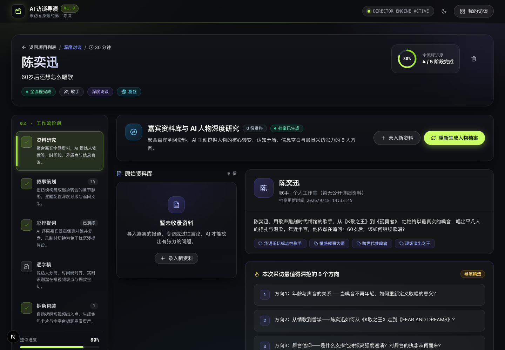
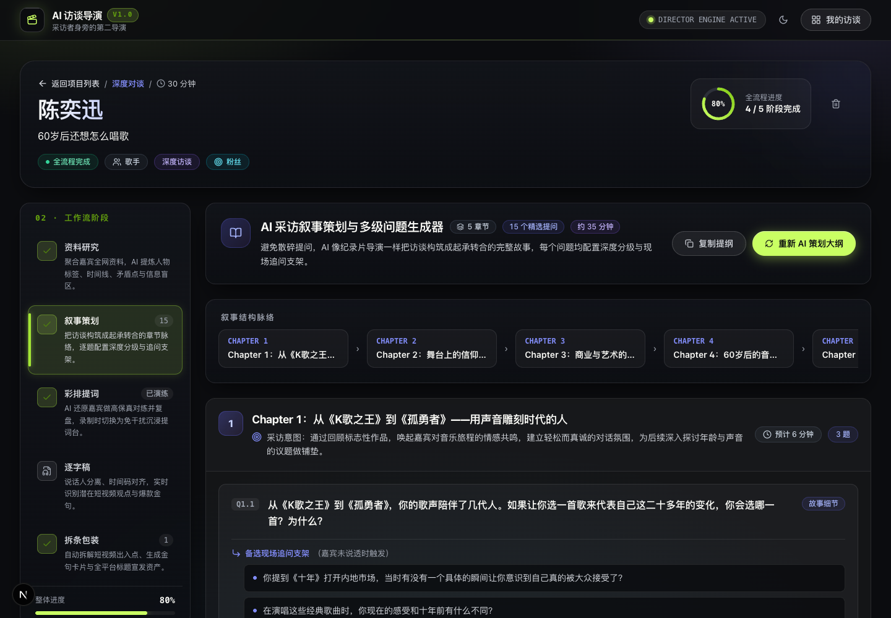
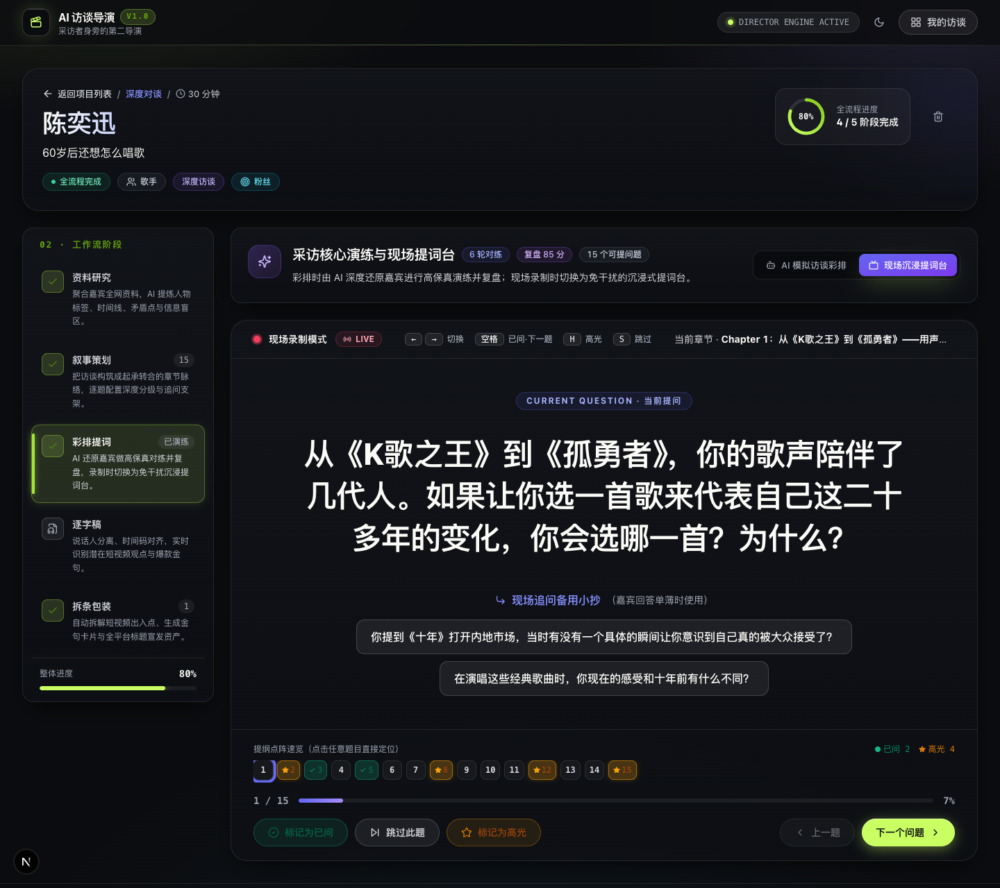
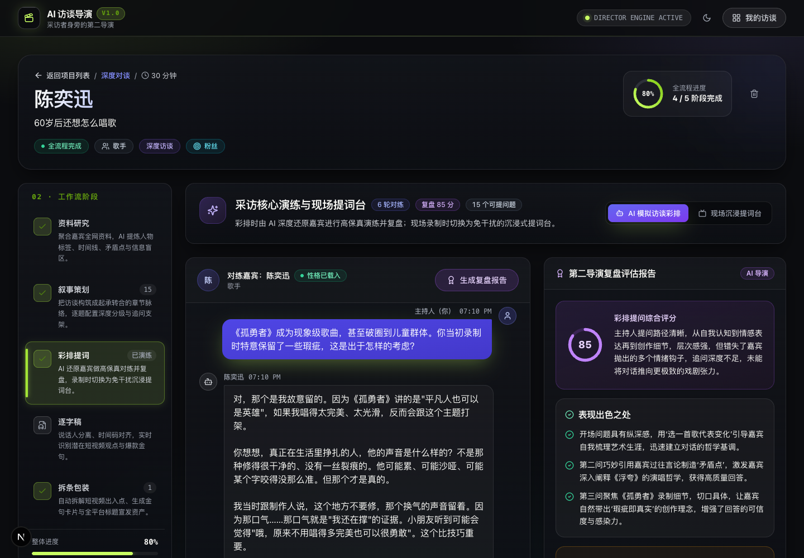
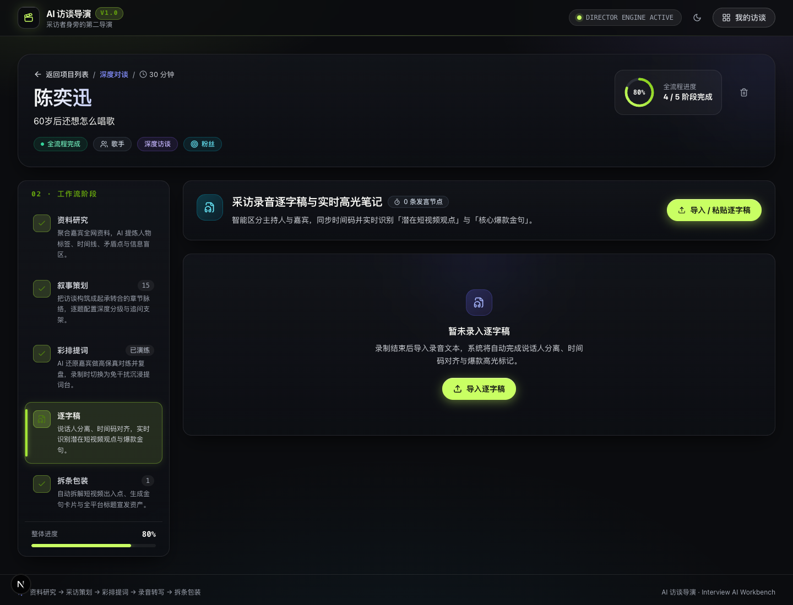
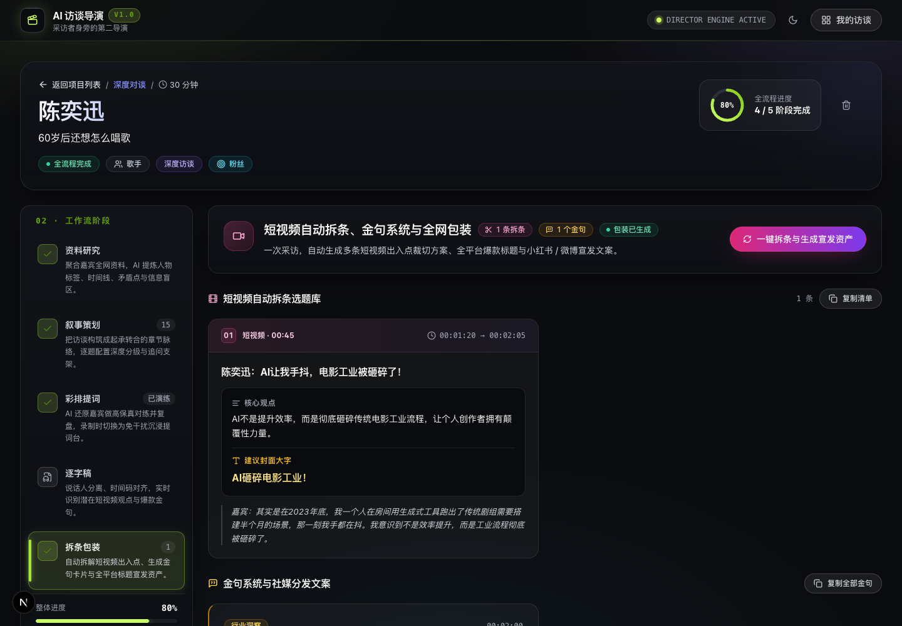

# 🎬 AI 访谈导演 (Interview AI)

> **采访者身旁的第二导演 · 贯穿「访谈前、访谈中、访谈后」的全流程 AI 协作工作台**

[](https://nextjs.org/)
[](https://react.dev/)
[](https://www.typescriptlang.org/)
[](https://tailwindcss.com/)
[](https://www.deepseek.com/)

---

<p align="center">
  
</p>

---

## 💡 产品定位与核心理念

在传统的视频访谈、播客制作或人物报道中，采访者往往面临：
- **资料繁多但碎片化**：散落于 Word、网页链接、备忘录与多个大模型对话框之间，上下文难以统一；
- **提问容易浮于表面**：缺乏纪录片导演级的起承转合，难以击中嘉宾的认知冲突与内核；
- **录制现场易失焦与卡壳**：双手忙于翻阅纸质提纲，错失关键追问时机，无法实时记录高光时刻；
- **后期整理极度繁重**：数小时的录音转写后，需要耗费数天人工挑选切片出入点与撰写宣发文案。

**AI 访谈导演** 的定位不是单纯的“语音转文字”或“AI 写几个零散问题”，而是将访谈全生命周期的上下文沉淀在统一的项目内：
> **让 AI 成为坐在采访者身旁的第二导演。**



---

## 🌟 五大核心功能模块与界面预览

### 1. 资料库与 AI 人物深度研究
- **多模态资料归集**：支持录入长篇报道、社媒动态、专访实录与现场调研碎片。
- **深度人物画像提炼**：自动梳理**人生关键时间线**、**代表作品**、**核心观点**与**高价值故事**。
- **矛盾冲突与盲区挖掘**：敏锐捕捉人物身上的**内心张力与价值冲突**（出彩点），以及资料中语焉不详的**信息盲区**。
- **Top 5 穿透性提问方向**：由 AI 导演精选输出本期访谈最具张力的 5 个切入点。

<p align="center">
  
</p>

---

### 2. 采访叙事策划与多级问题生成器
- **电影叙事化章节（Chapters）**：将访谈分为 4~5 个起承转合的故事阶段，分配时间与阶段目标。
- **多级深度提问体系**：
  - **基础背景（Normal）**：建立认知与安全感；
  - **故事细节（Story）**：引导嘉宾还原具象化现场与体感；
  - **深度交锋（Deep）**：触碰核心矛盾、价值观与终局思考。
- **现场追问备用小抄（Follow-up Seeds）**：每个问题配备现场即兴追问支架，避免回答单薄时冷场。

<p align="center">
  
</p>

---

### 3. AI 模拟访谈彩排与现场沉浸提词台

#### 现场沉浸提词台（Teleprompter Mode）
- **无干扰大字提词**：录制现场免触碰鼠标，支持键盘快捷键极速操控（`← / →` 切换，`空格` 已问并下一题，`H` 标记高光，`S` 跳过）。
- **全场提纲点阵速览（Matrix Dots）**：底栏实时展示所有题目的状态点阵（已问/跳过/高光），支持点击任意题号直接定位跳转。
- **高光焦点与 Toggle 撤销**：捕获爆点金句瞬间点亮琥珀金呼吸光晕，支持误触一键撤销。

<p align="center">
  
</p>

#### AI 高保真模拟彩排与第二导演复盘（Simulation Mode）
- **高保真角色演练**：AI 深度还原嘉宾性格、语言风格与防御心理，开录前与主持人实战对练。
- **第二导演复盘评估报告**：自动分析追问深度、错失良机，给出专业综合评分与战术锦囊。

<p align="center">
  
</p>

---

### 4. 采访录音整理与智能逐字稿
- **逐字稿智能解析**：角色说话人自动分离与精确时间码对齐。
- **高光爆点标注**：自动标记「🔥 核心爆款金句」与「🔥 潜在短视频选题」，一键定位精彩片刻。

<p align="center">
  
</p>

---

### 5. 短视频自动拆条、金句系统与全网包装
- **短视频自动切片方案**：智能标定出入点精确时间戳、核心观点摘要、12字封面爆款文案与精彩台词节选。
- **全平台宣发资产生成**：针对 **YouTube、B站、小红书、抖音** 一键定制差异化标题、节目简介、分P时间轴与 SEO 话题。
- **社交传播金句卡片**：自动提炼金句，生成海报文案与社媒宣发素材。

<p align="center">
  
</p>

---

## 🛠️ 技术架构

- **全栈框架**：Next.js 15 (App Router) + React 19 + TypeScript
- **设计系统**：Tailwind CSS + Lucide React，暗黑导播间风格、毛玻璃与微光氛围
- **大模型接入**：
  - 深度支持 **DeepSeek**（`deepseek-chat` / `deepseek-reasoner`）与 OpenAI 兼容接口；
  - 内置**智能 Mock 兜底引擎**：未配置 API Key 或网络离线时仍可完整演示全流程体验。
- **数据持久化**：本地 JSON 文件轻量存储（`data/projects.json`），内置成熟完整的演示案例。

---

## 🚀 快速上手

### 1. 克隆项目与安装依赖

```bash
git clone https://github.com/Wangfugui1799/ai-interview-director.git
cd ai-interview-director
npm install
```

### 2. 配置环境变量

复制配置文件：
```bash
cp .env.example .env.local
```

编辑 `.env.local` 填入您的模型 API Key（以 DeepSeek 为例）：
```env
OPENAI_API_KEY=your_deepseek_api_key_here
OPENAI_BASE_URL=https://api.deepseek.com
OPENAI_MODEL=deepseek-chat
```
> 💡 **提示**：若暂不配置 API Key，系统将自动进入 Mock 模式，可直接体验所有交互与演示数据。

### 3. 启动开发服务器

```bash
# 默认端口启动 (3000)
npm run dev

# 指定端口启动 (如 3001)
npx next dev -p 3001
```

在浏览器中打开 [http://localhost:3000](http://localhost:3000) 即可开始使用。

---

## 📂 项目目录结构

```text
ai-interview-director/
├── docs/
│   └── screenshots/              # 产品全流程高清实机截图
├── data/
│   └── projects.json             # 本地项目持久化数据（内置优质演示案例）
├── src/
│   ├── app/
│   │   ├── layout.tsx            # 全局导航与主题布局
│   │   ├── page.tsx              # 访谈看板与新建项目模态框
│   │   ├── projects/[id]/page.tsx# 访谈项目全生命周期工作台
│   │   └── api/                  # 业务后端路由（项目、调研、策划、模拟、拆条）
│   ├── components/
│   │   ├── profile/ProfileTab.tsx      # 资料库与 AI 人物研究
│   │   ├── planning/PlanningTab.tsx    # 叙事大纲与多级问题
│   │   ├── interview/InterviewTab.tsx  # 模拟彩排对练与现场提词台
│   │   ├── transcript/TranscriptTab.tsx# 智能逐字稿整理
│   │   └── content/ContentTab.tsx      # 短视频拆条与全网包装
│   ├── lib/
│   │   ├── ai/
│   │   │   ├── client.ts         # LLM 客户端与智能 Mock 引擎
│   │   │   └── prompts.ts        # 纪录片导演级 Prompt 提示词工程库
│   │   └── storage.ts            # 本地持久化存取服务
│   └── types/
│       └── index.ts              # 核心业务 TypeScript 接口定义
└── tailwind.config.ts            # Tailwind 样式配置
```

---

## 📄 开源许可证

本项目采用 [MIT License](LICENSE) 开源协议。
