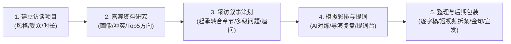

# 🎬 AI 访谈导演 (Interview AI)

> **采访者身旁的第二导演 · 贯穿「访谈前、访谈中、访谈后」的全流程 AI 协作工作台**

[](https://nextjs.org/)
[](https://react.dev/)
[](https://www.typescriptlang.org/)
[](https://tailwindcss.com/)
[](https://www.deepseek.com/)

---

## 💡 产品定位与核心理念

在传统的视频访谈、播客制作或人物报道中，采访者往往面临：
- 资料繁多但整理分散（散落于 Word、Notion、录音笔和 ChatGPT 之间）；
- 提问容易流于表面，缺少戏剧性张力与故事纵深；
- 现场采访容易偏离主题，遗漏关键追问良机；
- 采访结束后数小时的录音素材整理耗时费力，缺乏清晰的短视频切片方案。

**AI 访谈导演** 的定位不是单纯的“录音转文字”或“AI 写几个零散问题”，而是将访谈全生命周期的上下文沉淀在统一的项目内：
> **让 AI 成为坐在采访者身旁的第二个导演。**



---

## 🌟 五大核心功能模块

### 1. 资料库与 AI 人物深度研究
- **多模态资料归集**：支持录入网页文章、社交媒体动态、长文专访与私人备忘录。
- **深度人物画像提炼**：自动梳理**人生时间线**、**代表作品**、**核心观点**、**有价值的故事**。
- **矛盾与盲区挖掘**：敏锐捕捉人物身上的**认知冲突与内心张力**（访谈出彩点），以及资料中语焉不详的**信息盲区**。
- **Top 5 深挖方向**：AI 建议本期访谈最具穿透力的 5 个切入角度。

### 2. 采访叙事策划与多级问题生成器
- **电影叙事化章节（Chapters）**：将访谈分为 4~5 个起承转合的故事阶段，设定阶段目标与时间分配。
- **问题深度分级**：
  - **基础背景（Normal）**：建立认知基调；
  - **故事细节（Story）**：引导受访者还原具象化现场与体感；
  - **深度交锋（Deep）**：触及内心矛盾与行业终局思考。
- **现场追问支架（Follow-up Seeds）**：每个问题配备 2~3 个即兴追问提示，避免现场卡壳。

### 3. AI 模拟访谈与智能提词台
- **沉浸式模拟彩排**：AI 深度扮演目标嘉宾，主持人可在采访前进行仿真问答对练。
- **第二导演复盘评审**：彩排后一键出具打分报告，指出错失的追问良机与高价值追问金句。
- **现场提词台模式（Teleprompter）**：专为实拍设计的大字提词界面，支持标记「已问 / 跳过 / 高能」。

### 4. 采访录音整理与智能逐字稿
- **逐字稿解析**：一键粘贴录音文本，智能识别角色说话人与同步时间码。
- **高光标记识别**：自动高亮「🔥 潜在短视频观点」与「🔥 核心爆款金句」。

### 5. 短视频自动拆条、金句系统与全网包装
- **短视频自动拆条**：自动输出切片方案（标题、精准出入点时间戳、核心观点提炼、12字封面文案、台词节选）。
- **全网宣发资产包装**：针对 **YouTube、B站、抖音、小红书** 定制差异化爆款标题、节目简介、分P时间轴与 SEO 关键词。
- **多平台金句卡片**：提取适合传播的金句，生成海报文案与小红书/微博文案。

---

## 🛠️ 技术架构

- **全栈框架**：Next.js 15 (App Router) + React 19 + TypeScript
- **设计系统**：Tailwind CSS + Lucide React，暗黑导播间风格与毛玻璃质感
- **大模型接入**：
  - 深度支持 **DeepSeek**（`deepseek-chat` / `deepseek-reasoner`）与 OpenAI 兼容接口；
  - 内置**智能 Mock 兜底引擎**：未配置 API Key 或网络离线时仍可完整演示全流程体验。
- **数据存储**：轻量化本地文件持久化服务（`data/projects.json`），内置完整真实演示数据。

---

## 🚀 快速上手

### 1. 克隆项目与安装依赖

```bash
git clone https://github.com/your-username/ai-interview-director.git
cd ai-interview-director
npm install
```

### 2. 配置环境变量

复制配置文件：
```bash
cp .env.example .env.local
```

编辑 `.env.local` 填入您的模型 API Key（以 DeepSeek 为例）：
```env
OPENAI_API_KEY=your_deepseek_api_key_here
OPENAI_BASE_URL=https://api.deepseek.com
OPENAI_MODEL=deepseek-chat
```
> 💡 **提示**：若暂不配置 API Key，系统将自动进入 Mock 模式，可直接体验所有交互。

### 3. 启动开发服务器

```bash
# 默认端口启动 (3000)
npm run dev

# 指定端口启动 (如 3001)
npx next dev -p 3001
```

在浏览器中打开：[http://localhost:3001](http://localhost:3001) 即可进入工作台。

---

## 📂 项目目录结构

```text
ai-interview-director/
├── .env.example                  # 环境变量模版示例
├── data/
│   └── projects.json             # 本地项目持久化数据（内置优质演示案例）
├── src/
│   ├── app/
│   │   ├── layout.tsx            # 全局导航与主题布局
│   │   ├── page.tsx              # 访谈看板与新建项目模态框
│   │   ├── projects/[id]/page.tsx# 访谈项目全生命周期工作台
│   │   └── api/                  # 业务后端路由（项目、调研、策划、模拟、拆条）
│   ├── components/
│   │   ├── profile/ProfileTab.tsx      # 资料库与 AI 人物研究
│   │   ├── planning/PlanningTab.tsx    # 叙事大纲与多级问题
│   │   ├── interview/InterviewTab.tsx  # 模拟彩排对练与提词台
│   │   ├── transcript/TranscriptTab.tsx# 智能逐字稿整理
│   │   └── content/ContentTab.tsx      # 短视频拆条与全网包装
│   ├── lib/
│   │   ├── ai/
│   │   │   ├── client.ts         # LLM 客户端与智能 Mock 引擎
│   │   │   └── prompts.ts        # 纪录片导演级 Prompt 提示词工程库
│   │   └── storage.ts            # 本地持久化存取服务
│   └── types/
│       └── index.ts              # 核心业务 TypeScript 接口定义
└── tailwind.config.ts            # Tailwind 样式配置
```

---

## 📄 开源许可证

本项目采用 [MIT License](LICENSE) 开源协议。
