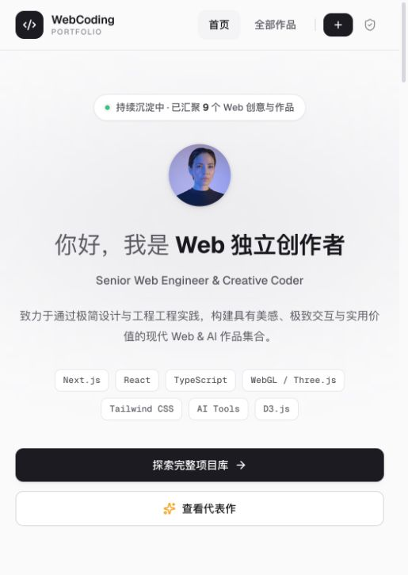
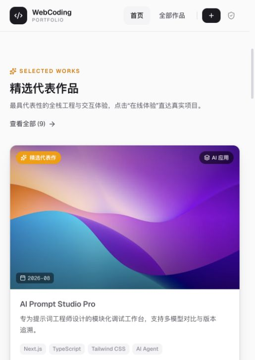

# WebCoding · 作品集合平台

一个用于展示、检索和管理个人 Web / AI 作品的全栈项目。前台展示精选作品与完整作品库，后台维护项目、分类和个人资料，无需为每个新作品修改页面代码。

[在线体验](https://webcoding-show.vercel.app) · [完整作品库](https://webcoding-show.vercel.app/projects) · [部署与数据迁移](docs/vercel-deployment.md)

## 项目截图

以下为线上页面的真实截图，展示窄屏响应式布局。截图采集于 2026-09-20；页面内容可通过后台更新。

| 首页 · 个人名片 | 精选作品 · 项目卡片 | 作品库 · 搜索与筛选 |
| --- | --- | --- |
|  |  |  |

## 主要功能

- **作品展示**：个人名片、精选代表作、分类导航、完整技术标签，以及作品详情、在线体验和源码链接。点击卡片内容进入详情页，点击图片放大查看。
- **作品检索**：关键词搜索、分类筛选、分页，以及精选优先、排序权重和完成时间等排序方式。
- **后台管理**：项目新增与编辑、草稿与发布状态、精选设置、分类管理、个人资料维护。
- **图片管理**：上传封面与头像，每个作品可额外添加 20 张图片，支持批量上传、图片链接、调整顺序和移除。前台相册支持切换、放大、键盘方向键及 Esc 关闭。支持 PNG、JPEG、WebP、GIF，单张最大 4 MiB；云端使用 Vercel Blob 持久化保存。
- **访问控制**：管理员密码登录、签名会话和 HttpOnly Cookie；生产环境使用 Secure Cookie，未登录访客无法读取草稿。
- **双环境开发**：本地 SQLite，生产 PostgreSQL；提供数据导出、导入和本地图片迁移脚本。

## 技术栈

| 模块 | 技术 |
| --- | --- |
| 全栈框架 | Next.js 16.3.5 · App Router · TypeScript |
| UI | React 19.2 · Tailwind CSS 4 · Lucide React |
| 数据库 | Prisma 6.19.3 · SQLite（本地）· Neon PostgreSQL（云端） |
| 图片存储 | 本地文件 / Vercel Blob |
| 认证 | Web Crypto HMAC 签名会话 · HttpOnly Cookie |
| 部署 | Vercel · GitHub `main` 分支自动部署 |

## 本地运行

建议使用 Node.js 24，与当前 Vercel 项目的运行时保持一致。

### 1. 获取项目

```bash
git clone https://github.com/Eason-Xi/WebCodingShow.git
cd WebCodingShow
cp .env.example .env
```

编辑 `.env`：保留本地 SQLite 的 `DATABASE_URL="file:./dev.db"`，设置独立的 `ADMIN_PASSWORD`（至少 12 位）和随机 `JWT_SECRET`（至少 32 位）。项目不提供默认管理员密码。

### 2. 安装依赖并初始化数据库

```bash
npm ci
npx prisma db push
npm run db:seed
```

`db:seed` 会写入演示分类、标签和项目，仅用于初始化演示环境；不要对已有真实数据的生产数据库执行。演示作品的介绍和外链是占位内容，正式使用时请在后台替换。

已有本地数据库升级时，运行 `npm run db:generate` 和 `npx prisma db push` 同步新增图片字段即可，无需重新 seed。生产部署自动执行增量迁移，已有封面和详情会保留。后台“作品详情”支持多段文字，保存后同步到前台详情页；只有已发布作品具有公开详情页。

### 3. 启动开发服务

```bash
npm run dev
```

打开 [本地首页](http://localhost:3000)，访问 [管理后台](http://localhost:3000/admin) 并使用 `.env` 中的管理员密码登录。

> `.env.local` 的优先级高于 `.env`。从云端环境切回 SQLite 时，先移走云端环境文件，运行 `npm run db:generate`，再重启开发服务。

## 常用命令

| 命令 | 用途 |
| --- | --- |
| `npm run dev` | 生成 Prisma Client 并启动开发服务 |
| `npm run build` / `npm run start` | 生产构建 / 启动生产服务 |
| `npm test` | 会话、上传规则和数据库模型一致性测试 |
| `npx tsc --noEmit` | TypeScript 类型检查 |
| `npm run db:generate` | 根据环境变量选择 SQLite 或 PostgreSQL Client |
| `npm run db:migrate` | 应用已提交的数据库迁移 |
| `npm run data:export` | 将现有内容备份至本地 `backups/` |
| `npm run data:import` | 将备份导入空 PostgreSQL 数据库并迁移本地图片 |

## 部署到 Vercel

当前线上地址为 [webcoding-show.vercel.app](https://webcoding-show.vercel.app)，连接仓库 `Eason-Xi/WebCodingShow` 的 `main` 分支。

部署时需要配置以下环境变量，具体步骤见 [部署与数据迁移说明](docs/vercel-deployment.md)：

| 环境变量 | 用途 |
| --- | --- |
| `DATABASE_URL` | PostgreSQL 池化连接地址 |
| `DIRECT_URL` | PostgreSQL 直连地址，用于数据库迁移 |
| `BLOB_READ_WRITE_TOKEN` | Vercel Blob 图片存储读写凭证 |
| `ADMIN_PASSWORD` | 独立的管理员密码，至少 12 位 |
| `JWT_SECRET` | 随机会话签名密钥，至少 32 位 |
| `GITHUB_TOKEN`（可选） | 服务端 GitHub 访问凭证，提高仓库读取限额；读取私有仓库需要相应权限 |

录入作品时，在“线上 URL”填入 GitHub 仓库地址并点击“智能提取项目信息”，或在“源码 GitHub URL”旁点击“自动填写标签与扩展字段”。系统合并仓库 Topics、主要语言与 README 中识别到的技术为标签，并用 README、仓库简介和语言统计补充技术说明。标签以逗号分隔，可保留 `Tailwind CSS` 等带空格的名称。完成年月取仓库最近推送月份作为建议，可手动修改；排序权重由管理员设置。API 限流时会尝试读取公开仓库页面，无法获取的完成年月留空。其余已填写字段会保留，导入结果需检查后再发布。

`vercel.json` 使用 `npm run vercel-build`，依次检查配置、生成 Prisma Client、应用 PostgreSQL 迁移并构建应用，不会自动写入演示数据。

请勿提交 `.env`、云端凭证、数据库文件或备份。Preview 应使用独立数据库或 Neon 分支，避免测试影响生产数据。

## 项目结构

```text
src/
├── app/
│   ├── page.tsx             # 首页：个人名片、精选作品、分类导航
│   ├── projects/            # 完整作品库
│   ├── admin/               # 登录、仪表盘、项目、分类和个人资料管理
│   └── api/                 # 项目、认证、上传等接口
├── components/              # 导航、页脚、项目卡片等组件
├── lib/                     # 认证、Prisma 客户端和上传规则
└── proxy.ts                 # 后台路由访问保护
prisma/
├── schema.prisma            # 本地 SQLite 模型
├── seed.ts                  # 演示数据初始化
└── postgresql/              # 生产 PostgreSQL 模型与迁移
scripts/                     # 数据库切换、部署构建、数据迁移脚本
tests/                       # 自动化测试
docs/                        # 部署文档与项目截图
```
